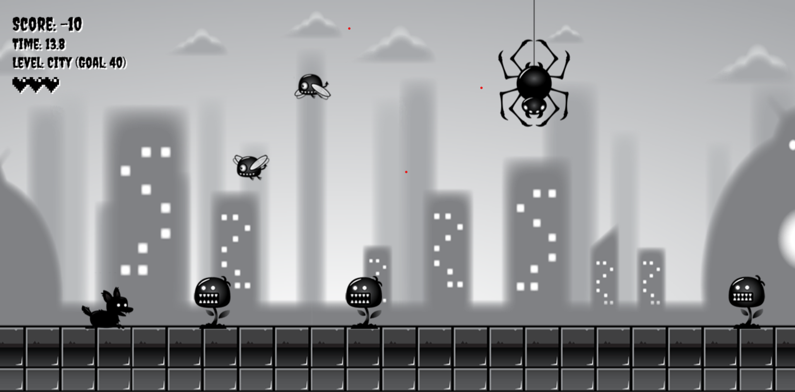

# Endless Runner

A browser-based 2D endless runner made with HTML5 Canvas and vanilla JavaScript. Choose a world, dodge or roll through enemies, and see how long you can survive as the pace and enemy patterns ramp up.

<div></div>

**Play:** [Open the game](https://souravbanerjeedata.github.io/endless-runner-game-in-js/)

## Destinations

Choose from five scrolling worlds, each with layered parallax backgrounds and its own enemy mix:

- City
- Forest
- Hills
- Mushroom Valley
- Desert Run

The game randomly selects one of two player appearances when a destination is chosen. Runs end in victory at 150 points, or in defeat if your score falls below zero or you lose all five lives. After the result, the game returns to the destination page.

## How to play

Avoid enemies, or use a roll or dive to defeat them. Defeating an enemy earns one point. Getting hit while not rolling or diving costs one point and one life.

### Keyboard

| Key          | Action                               |
| ------------ | ------------------------------------ |
| `←` / `→`    | Move left or right                   |
| `↑`          | Jump                                 |
| `↓`          | Sit on the ground or dive in the air |
| `Enter`      | Roll while held                      |
| Pause button | Pause or resume                      |
| `D`          | Toggle debug hitboxes                |

### Touch screens

The game has touch controls and is playable on mobile browsers. Touch and hold the left or right half of the game to move in that direction. Swipe up to jump and swipe down to sit or dive. Double-tap to toggle rolling; double-tap again to stop. Use the on-screen pause button to pause.

The game canvas fills the browser window and scales when the window is resized. No app install is required. For the clearest view, use a modern browser and landscape orientation; the game does not force or lock the device orientation.

## Run locally

The game uses JavaScript modules, so serve the project over HTTP rather than opening `index.html` directly from the file system.

```sh
git clone https://github.com/Souravbanerjeedata/endless-runner-game-in-js.git
cd endless-runner-game-in-js
python -m http.server 8000
```

Then open [http://localhost:8000](http://localhost:8000). Any static web server can be used; there is no build step or package installation.

## Project files

```text
index.html                 Game canvas, menus, and image assets
style.css                  Layout and responsive styling
main.js                    Game loop, destination selection, scoring, and spawning
player.js                  Player rendering, animation, and collision handling
playerStates.js            Player movement state machine
enemies.js                 Enemy types and movement patterns
background.js              Parallax background layers
input.js                   Keyboard and touch input
UI.js                      Score, lives, pause, and result display
particles.js               Particle effects
collisionAnimation.js      Enemy collision effects
floatingMessages.js        Floating score messages
assets/                    Player, enemy, background, and effect artwork
preview.png                Repository preview image
```

## Built with

- HTML5 Canvas
- Vanilla JavaScript using ES modules
- CSS

There are no frameworks, build tools, or runtime package dependencies.
